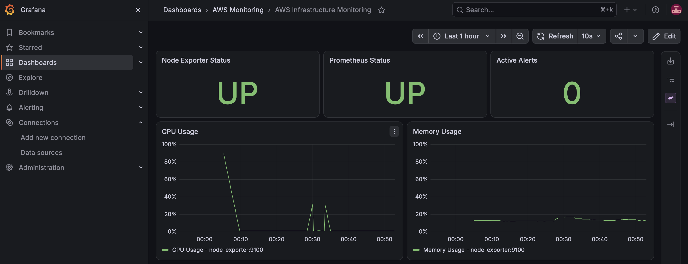
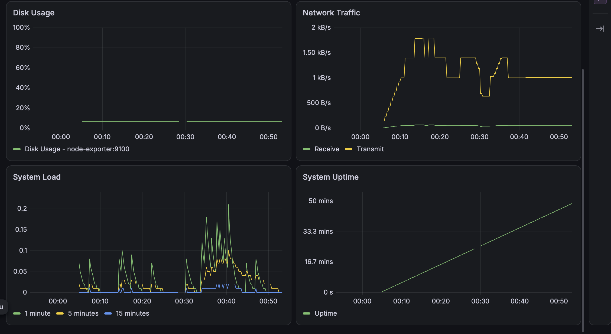

# AWS Infrastructure Monitoring

[](https://github.com/Cgarg547/AWS-Infrastructure-Monitoring/actions/workflows/ci.yml)

🌐 **Live Portfolio:** https://aws-infrastructure-monitoring.vercel.app/

📦 **GitHub Repository:** https://github.com/Cgarg547/AWS-Infrastructure-Monitoring

A production-style infrastructure monitoring stack built with **Prometheus, Grafana, Alertmanager, Node Exporter, Docker Compose, Terraform, and GitHub Actions**.

The project provides real-time infrastructure metrics, dashboards, alerting, recording rules, automated health checks, and CI-based configuration validation.

> **Current deployment:** The monitoring stack runs locally using Docker Compose. Terraform configuration for AWS infrastructure is included and validated, but AWS deployment is intentionally not performed in this version.

---

## 🚀 Project Overview

This project demonstrates how to build and validate an infrastructure monitoring platform using modern observability and DevOps tools.

The monitoring stack collects system-level metrics using Node Exporter, stores and evaluates those metrics with Prometheus, routes alerts through Alertmanager, and visualizes infrastructure health using Grafana.

The project also includes:

- Infrastructure-as-Code using Terraform
- Docker Compose orchestration
- Prometheus recording rules
- Prometheus alert rules
- Alertmanager severity-based routing
- Automated health checks
- GitHub Actions CI validation
- YAML validation
- Prometheus configuration validation
- Grafana dashboard validation
- Terraform validation

---

# 📸 Monitoring Dashboard

The Grafana dashboard provides a centralized view of infrastructure health and performance.

## Dashboard Overview



## Infrastructure Metrics



The dashboard monitors:

- Node Exporter status
- Prometheus status
- Active alerts
- CPU usage
- Memory usage
- Disk usage
- Network traffic
- System load
- System uptime

---

# 🚀 Features

- Real-time infrastructure monitoring with Prometheus
- System metrics collected using Node Exporter
- Grafana monitoring dashboard
- Alertmanager integration
- Critical and warning alert routing
- CPU monitoring
- Memory monitoring
- Disk monitoring
- Network monitoring
- Prometheus recording rules
- Infrastructure health/status panels
- Automated monitoring health-check script
- Docker Compose deployment
- Terraform infrastructure configuration
- GitHub Actions CI validation
- Prometheus configuration and rule validation
- Grafana dashboard JSON validation
- Shell-script syntax validation
- Terraform formatting and validation

---

# 🏗️ Architecture

```text
                         ┌──────────────────────┐
                         │       Grafana        │
                         │    Visualization     │
                         │       :3000          │
                         └──────────┬───────────┘
                                    │
                                    ▼
                         ┌──────────────────────┐
                         │     Prometheus       │
                         │    Metrics + Rules   │
                         │       :9090          │
                         └──────┬─────────┬─────┘
                                │         │
                    ┌───────────┘         └──────────────┐
                    ▼                                    ▼
           ┌──────────────────┐                ┌──────────────────┐
           │  Node Exporter   │                │   Alertmanager   │
           │      :9100       │                │      :9093       │
           │  System Metrics  │                │  Alert Routing   │
           └──────────────────┘                └──────────────────┘